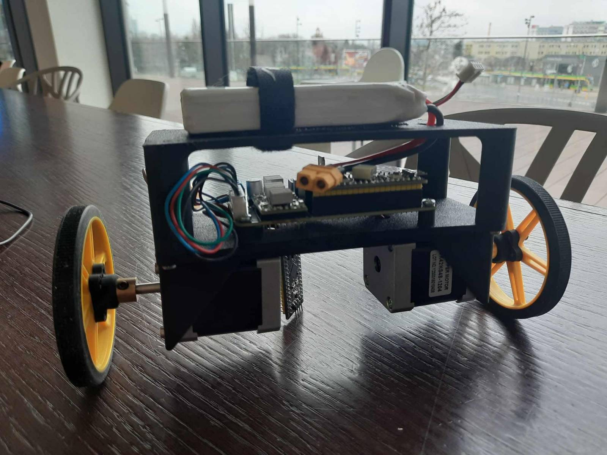

# Projekt na przedmiot TSwR

**Samobalansujący robot dwukołowy**

## Opis

Głównym celem projektu jest opracowanie zaawansowanego algorytmu sterowania ruchem dla mobilnego robota dwukołowego (klasy odwróconego wahadła z napędem różnicowym). Docelowo układ ma zapewniać stabilizację pozycji pionowej przy jednoczesnym, precyzyjnym śledzeniu zadanej trajektorii.

Platforma sprzętowa została zbudowana i wstępnie uruchomiona w ramach wcześniejszego projektu przejściowego. Wykorzystane wówczas sterowanie, oparte na klasycznych regulatorach PID, nie przyniosło jednak w pełni satysfakcjonujących rezultatów. Choć robot potrafił utrzymać równowagę, jakość regulacji była niska, a w układzie występował zauważalny dryft pozycji. 

Bieżący projekt skupia się na wyeliminowaniu tych wad poprzez zaprojektowanie nowoczesnego i zoptymalizowanego obliczeniowo algorytmu. Pomyślna weryfikacja zaproponowanego rozwiązania w środowisku symulacyjnym pozwoli na jego ostateczne wdrożenie i uruchomienie na rzeczywistym obiekcie fizycznym.

Zdjecie:

## Symulacja

Python + PyOpenGL + acados

## Sterownik: Model Predictive Control (MPC)

W projekcie zdecydowano się na rezygnację z klasycznych regulatorów PID na rzecz **sterowania predykcyjnego (MPC)**. Wybór ten podyktowany jest kilkoma kluczowymi czynnikami:

1. **Obsługa ograniczeń:** MPC pozwala na bezpośrednie uwzględnienie ograniczeń fizycznych robota (np. maksymalne napięcie zasilania silników, dopuszczalny prąd czy maksymalny kąt wychylenia) już na etapie projektowania algorytmu.
2. **Optymalizacja wielowymiarowa:** W przeciwieństwie do PID, MPC w sposób naturalny radzi sobie z układami MIMO (Multiple Input Multiple Output), optymalizując jednocześnie stabilność pionową oraz precyzyjne śledzenie trajektorii, co eliminuje problem dryftu pozycji.
3. **Predykcja:** Algorytm przewiduje zachowanie robota w horyzoncie czasu, co pozwala na płynniejsze reakcje i lepszą jakość regulacji przy dynamicznych zmianach ruchu.

## Kamienie milowe (Milestones)

- [x] **Projekt i wykonanie nowej jednostki sterującej:** Zaprojektowanie, zmontowanie oraz integracja autorskiej płytki PCB z wydajniejszym mikrokontrolerem STM32, zapewniającym odpowiednią moc obliczeniową dla algorytmów MPC.
- [x] **Optymalizacja mechaniczna konstrukcji:** Zastosowanie wibroizolacji dla układu IMU oraz zmniejszenie rozstawu kół, co znacząco poprawi dynamikę obrotu robota wokół osi pionowej (osi Z).
- [x] **Analiza parametrów fizycznych (CAD):** Wyznaczenie przybliżonego położenia środka ciężkości robota oraz jego momentów bezwładności względem osi obrotu kół za pomocą oprogramowania CAD.
- [x] **Modelowanie matematyczne:** Analityczne wyprowadzenie nieliniowych równań ruchu robota w oparciu o zdefiniowany wektor stanu oraz wejścia sterujące (momenty silników).
- [x] **Środowisko symulacyjne:** Stworzenie symulacji dynamiki robota w języku Python i implementacja algorytmu predykcyjnego z wykorzystaniem solvera *acados*.
- [ ] **Niskopoziomowa integracja systemu:** Wdrożenie sterownika na fizycznym obiekcie, napisanie sterowników sprzętowych dla silników krokowych oraz płynna obsługa danych z czujnika IMU.
- [ ] **Stabilizacja pionowa:** Uruchomienie układu regulacji i uzyskanie stabilnego balansowania robota w miejscu.
- [ ] **Śledzenie trajektorii:** Realizacja kontrolowanego ruchu wzdłuż zadanej ścieżki w oparciu o odometrię (zliczanie zadanych kroków silników).